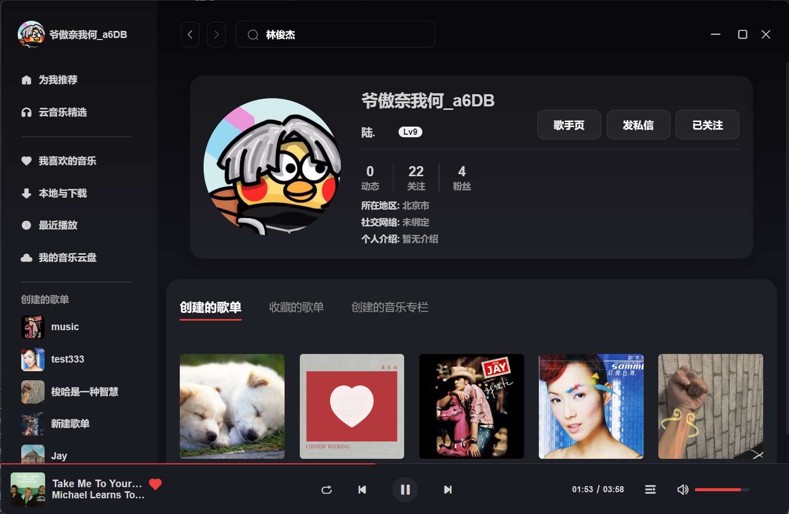
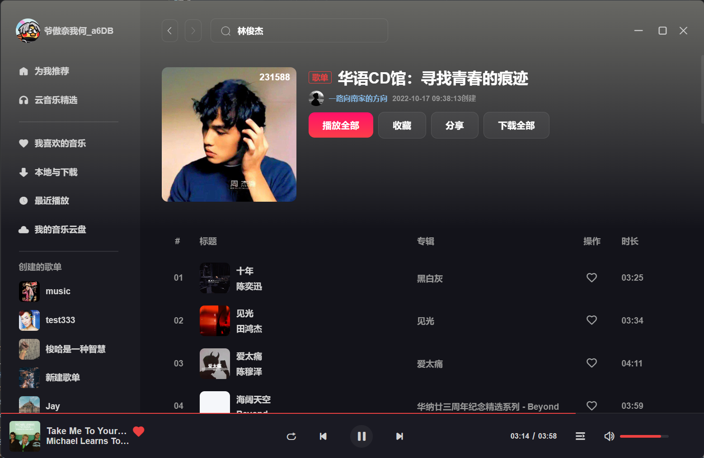
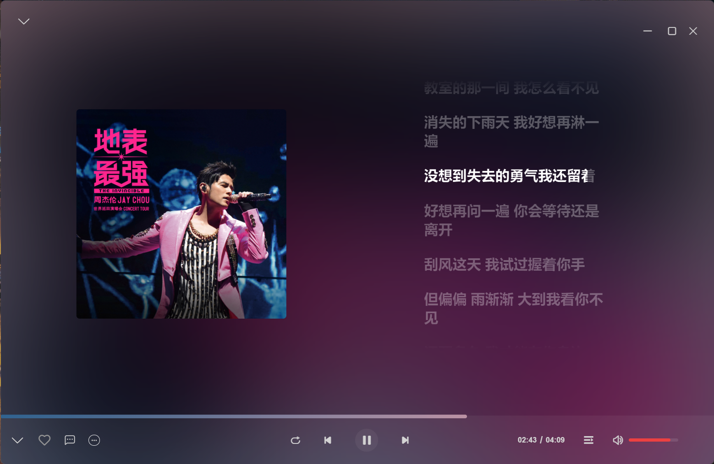

# Vue 3 + TypeScript + Vite + electron

## 安装

### 1. 克隆本地服务器
在github上拉取node服务
https://github.com/Binaryify/NeteaseCloudMusicApi
```
1. 安装依赖
npm/yarn install
2. 启动服务
npm/yarn start
```

### 2. 启动 cloud
```
1. node版本至少大于15

2. 安装依赖
yarn install

3. 启动服务
yarn dev

4. 打包应用
electron: yarn build-electron
web: yarn build

```

# 进度
1. 可以获取用户创建菜单（我喜欢的音乐），可以播放，一些菜单的操作已完成
2. 首页部分推荐歌单已完成
3. 搜索歌曲
4. 歌曲详情
5. 用户详情


# 请求器
````
当父组件通过模板 ref 的方式获取到当前组件的实例，获取到的实例会像这样 { a: number, b: number } (ref 会和在普通实例中一样被自动解包)
项目里集成了components文件下自动引入,您可以无需引入直接使用即可（推荐引用,这样可以让ts更好的识别类型）

vite 提供了两种模式：具有开发服务器的开发模式（development）和生产模式（production）
组件中使用：
console.log(import.meta.env.VITE_APP_WEB_URL)

请求器一共有四种调用方式   配置型请求默认为get，其余三种默认都为post
  <R extends unknown, D>(config: AxiosRequestConfig & {data: R, params: R}): Promise<D>;
  <R extends unknown, D>(url: string, method?: Method, config?: AxiosRequestConfig & {data: R, params: R}): Promise<D>;
  <R extends unknown, D>(url: string, data: R, method?: Method): Promise<D>;
  <R extends unknown, D>(url: string, data: R, config?: AxiosRequestConfig): Promise<D>;
  
重写了audio的play和pause，让他们具有音量过渡效果
    开始播放的过渡时间比暂停长一点，这样效果感觉会更好些
````

# 引用
````
在全局上暴露了播放器的组件实例, $audio, 它被挂在到了window上
你可以调用其暴露出来的部分方法, 例如: play、pause、el、isPlay等等...

````

# 项目仍在进行中...






# Electron API
```
win.maximize() // 最大化窗口
win.unmaximize() // 取消最大化窗口
win.minimize() // 最小化窗口
win.restore() // 将窗口从最小化状态还原到其以前的状态
win.close() // 尝试关闭窗口。这与用户手动单击窗口的关闭按钮具有相同的效果
```
